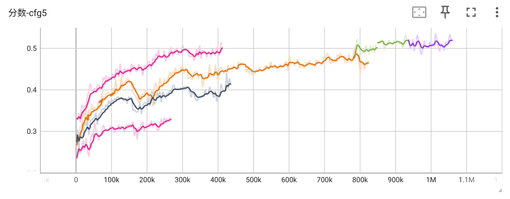

# 【RUM】用跨架构蒸馏代替扩散模型的继续预训练！

事情是这样的，现在有很多开源的动漫图片生成模型，它们主要是基于SDXL训练来的，有些模型的效果也挺好。

不过，动漫模型的更新太慢了，2026年了社区主流还是SDXL。

这主要是因为继续预训练太贵了，其实这两年有很多新的架构，它们有变好，但是没有好太多，所以大家就不太愿意在新的基础模型上，重新做继续预训练了。

不过，既然我们已经有了很好的SDXL的动漫模型，可以利用这1点来大幅降低训练成本。

这样1来，大家就可以在各种新模型上画动漫的女孩子！

太好了，开启动漫模型的新纪元！

> 顺便和不了解动漫模型的观众解释1下，大家可能觉得奇怪说动漫风格是不是很容易就训好了，为什么会贵。
>
> 其实不是这样，动漫模型通常是这样，它是要能生成高质量的插画，比如达到或者接近真人的插画师的水平，所以并不是训练1个画风LORA就可以的。

## 原理

主要还是受到[Rectified Flow](https://arxiv.org/abs/2209.03003)这1篇的启发。

是这样的，扩散模型训练很慢，很大的1个原因是训练时它在每个step中看到ground truth(等价于V)，总是并非模型训练完成后的ODE在这个位置的V。举个例子，假设现在的timestep是1000(完全是噪声)，prompt是「初音miku在唱歌」，不过数据集中有100个初音miku在唱歌的图片。尽管训练时大家都是先取样本再取噪声，不过这2者显然是独立的，我们反过来看，对于任意1个确定的噪声，既然收敛到每个miku的概率都相同，那此时真正的ground truth应该指向这100个样本的中心，但在训练时，它却只能指向1个特定的样本。这不对，这就导致V在不同step间被拉来拉去，因此训练效率低。

那有没有办法在训练时直接得到真正的V呢？诶，其实有，我们前面提到了，我们已经有很好的SDXL的动漫模型，这不就有V嘛！

好耶，这么简单就解决了！不过倒也没有，接下来我来具体说1下是要怎样做吧。

我训练了SD3.5和Flux2-klein，为了方便就以SD3.5为例来说——

首先第1个问题是，SD3.5和SDXL的Latent空间不1样，直接把V移植过去没有意义，而且形状也不对。这个的解决方法是这样，我们把Latent空间分成3个部分，t=0时样本端是对应自然图像的，t=1000时是噪声端，什么也不对应，还有剩下中间的部分。

- 在样本端，大家肯定能猜到，只需要过2次VAE，就可以把Tensor转移到另1边的Latent空间。
- 在噪声端，因为VAE并非是在噪声空间中训练的，所以没法对噪声做decode再encode。不过好在噪声总是高斯分布的，这2个模型正好空间压缩率也相等，它们的差别只在于1个是16通道，1个是4通道，所以简单把16个通道分成4×4，即每4个1组取平均就变成4通道，再把数值×2来对齐1下方差，它们的形状和分布就都对齐了。
- 中间的部分就用插值插1下好了。不过因为diffusion公式不同，插的时候不能直接线性插，要对齐1下信噪比。原本的公式很长，不管了，我们把2个模型公式的简化成`f3(t1)*X0 + f4(t1)*noise`和`f5(t2)*X0 + f6(t2)*noise`，其中4个f都是单调的，那么对于左边的`t1`，总能找到唯1的`t2`，使两边的信噪比相同，然后用`t2`去算右边就可以了。

好，这样1来，我们就有了1个这2个空间之间的映射。这里不是完整的双射，因为噪声端是没法从少变多的，不过好在我们下面恰好用不到它。

做完映射之后，接下来要来决定训练的目标，这里有2种做法，第1种是比较接近原版的diffusion，就叫它diffusion形式好了，具体是这样:

1. 【在SD3.5的Latent空间】随机选1个样本，随机选1个噪声，插值出1个Xt。
2. 【在SDXL的Latent空间】通过映射得到样本和噪声，插出1个Xt2，然后用SDXL对着Xt2预测n步，得到X02。
3. 【在SD3.5的Latent空间】再把X02映射回来，用它减去第1步的Xt算出V。

第2种做法比较接近reflow，就叫reflow形式吧，具体是这样:

1. 【在SD3.5的Latent空间】随机选1个噪声，把样本丢掉。
2. 【在SDXL的Latent空间】通过映射得到噪声，用SDXL对着噪声预测n步，得到X02。
3. 【在SD3.5的Latent空间】把X02映射回来，用它和第1步的噪声插值出1个Xt，用X02-Xt算出V。

1开始写的是diffusion形式，不过试下来发现reflow形式收敛的速度和效果都要更好(下面有对比)。

此外，还有1个地方就是，SD3.5有3个text encoder，其中有1个CLIP和SDXL的是完全相同的，可以直接把它的权重替换过来，这样训练可以更快。

好，差不多就是这样了！

## 训练过程

这个模型是使用单卡RTX5090训练的。

训练用的教师模型是[WAI-illustrious-SDXL](https://civitai.com/models/827184)，训练数据是danbooru2024简单抽了1个很小的子集，总共100k数据。

学生模型可以是[stable-diffusion-3.5-medium](https://huggingface.co/stabilityai/stable-diffusion-3.5-medium)或者[FLUX.2-klein-base-4B](https://huggingface.co/black-forest-labs/FLUX.2-klein-base-4B)，Flux2-klein的9B版本也验证过能跑，不过比较贵我就没有训。

现在做的训练分为两个阶段，但其实不需要，这里只是记录1下我的训练过程，主要是我在训练过程中走了不少弯路，大家吸取了经验之后从头开始训，肯定可以比我训得更快，成本更低。

第1阶段是0~608000step。

- 我为了让它快1点，提前训了1个SDXL的步数蒸馏模型把原版SDXL替换掉(我用的是[这个](https://github.com/G-U-N/Rectified-Diffusion)，每个训练step推理4个step。做1遍步数蒸馏，通常只要1-2天即可。

- 因为加载了太多模型，5090是放不下的。所以实际上这些模型是半在线的，代码是这样预计算的: 每轮先加载50个样本，然后用TE/VAE/SDXL把我们前面说的Xt2、X02什么的全部都算出来，然后把这些模型放回RAM，最后再训练50个step的DiT。这样的话纯bf16峰值VRAM大约是31G。

- 每天可以训练21000个step。这部分成本按`608000 / 21000 + 2`算，就是31GPU天。

第2阶段是608000~1550000step。

- 发现提前对教师模型做蒸馏的效果并不好，因此换回了原版教师模型，用DPM跑25步。不过这样再做半在线就太慢了，因此提前把数据刷了4个epoch，后面就不再跑教师模型了，刷这些大概花了12天。

- 发现BS=1不是很稳定，实现了1个分桶，不过发现batch和gradient accumulation的速度其实基本1致，所以还是用了GA=4，这样比分桶更均匀1些。

- 每天可以训练15000个step。这部分成本按`(1550000-608000) / 15000 + 12`算，就是75GPU天。

5090单卡的租赁价格大概是每天$5，现在训练成本才只要$530，原本继续预训练1个动漫模型，典型的花费要超过$50000(我去问了NoobAI-XL的owner)，这样1下就省了99%的钱啦！当然这个对比其实不公平，正规的$50000的模型其实效果要比我这个好1些。

## 评估

因为微调动漫模型的人1般不公开数据集，所以没有办法测FID。

这里的评估用的都是标签模型，构造了这样2个指标:

- 第1个是ML-Danbooru，是1个标签模型。评估方法是先用标签构造1组n个prompt，每个prompt包含m个标签，让模型生成之后再检测图像中有没有对应的标签，最终的分数就是`命中的标签 / (n×m)`。

- 第2个是WD14，用来识别动漫角色。评估方法是构造1组prompt，每个prompt包含1个人物，让模型生成之后再检测图像中有没有对应的人物，最终的分数就是`命中的标签 / n`。

## 消融实验

下面是SD3.5在不同参数下的ML-Danbooru得分对step的曲线，从上到下4条线代表的4个实验分别是:

1. reflow形式+替换CLIP。
2. diffusion形式+替换CLIP。
3. diffusion形式+不替换CLIP。
4. 原版(也是这个训练代码，临时去除了teacher训的)

右边那几个彩色的线其实是用diffusion形式训了几天，然后觉得不对又换成reflow形式导致的。

(所以你们能猜到实验1其实反而是最后补的)

## 权重和效果

我把权重放在了huggingface的[RUM-FLUX.2-klein-4B-preview](https://huggingface.co/rimochan/RUM-FLUX.2-klein-4B-preview/tree/main)，大家可以下载回来试1试。

下面是训练到1158k step的效果。能看出模型的prompt遵循还是很好的，人物和画师风格都不错，但是手指这些细节比较容易出问题。

不过好在指标也还在涨，我反正就放着继续训，可能下个月它就如臻化境了！

使用方法可以看这个[使用文档](使用文档.md)。

对了，这个是Flux2-klein，上面的指标曲线是SD3.5，大家不要看错了。

然后SD3.5那个反正已经落伍了，应该也没有人会想去用，我就不放权重了，对它的效果有兴趣的话可以到`img`文件夹里面自己看。

## 如何训练

要把训练跑起来并不是那么复杂，但其实是有满多细节的。如果有什么遗漏的话，可能效果就不好。因此单独写了1个训练文档，可以看这个[训练文档](训练文档.md)。

## 1些问题

1. 数学直觉好的观众可能会发现，对Latent空间做了映射之后其实是扭曲的吧？映射之后它还是Rectified Flow说的最优传输吗？

对，我的理解是，Latent空间是扭曲的，因此它不是最优传输了。前面有提到，我提前对SDXL模型做了步数蒸馏，并且训练的方式也和Rectified Flow很像，但是最终得到的模型反而不是步数蒸馏的。如果认为Latent空间确实扭曲了，这个现象就能解释得通。不过，尽管这导致蒸馏模型能1步到位的能力失效，但好在ODE上每个位置的V还是连续的，因此它只要慢慢走，仍然能收敛到1个合理的X0。

2. 换掉CLIP是不是过于取巧了？那我想训最新的模型，比如Z-Image，它没有CLIP怎么办？

从之前的消融的结果来看，可以看出在加速上蒸馏的贡献还是占主导的，至少前面那些没有在白说啦。CLIP能变快，那反正就加上，省点训练成本总比没有好。

然后模型没有CLIP怎么办，可以试试自己用手加1路。或者就不要CLIP硬训也行，但是在Flux上的实验有发现，带上CLIP的话，对角色的学习会快很多。

3. 为什么用diffusion形式计算V时，不能只走1步？这样就会比reflow形式快吧。

SDXL实际预测的是epsilon，尽管公式上等价于X，但是这样算出的X并不会完全干净，等下要过2次VAE的时候没法处理残留的噪声成分，会产生1些横竖交错的伪影。所以只好换成正规的扩散推理过程，让模型走全程。

不过前文有提到，教师模型也是预先蒸馏过的，所以实际上也不会慢很多就是了。

## 题外话

大家可能会想为什么英文名叫RUM，而且除了标题就再也没有提到了……

其实是游戏王的升阶魔法(Rank-Up-Magic)，给没有玩过的观众解释1下，升阶魔法大概效果就是把怪兽升级为不同的怪兽，而新怪兽的能力会是原怪兽的升级版。正是非常合适的名字！

大家发论文经常玩梗，就故意先找1个缩写然后用英语去凑嘛，我不发论文所以凑的部分就省下来了！

## 结束

就这样，大家88，我要去召唤究极至高的隼了！
