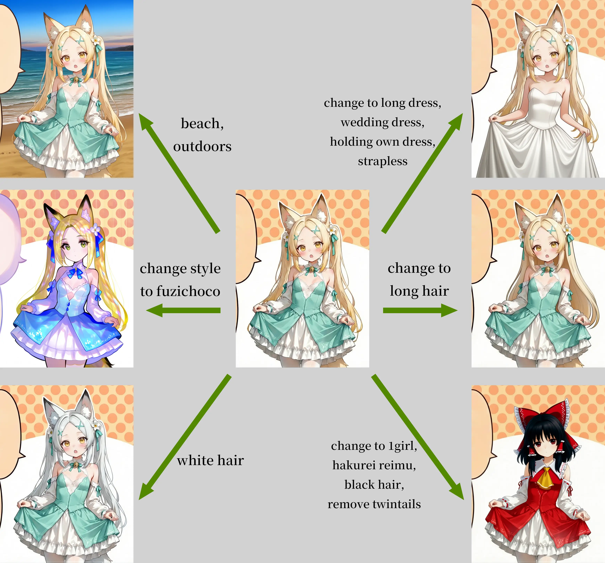
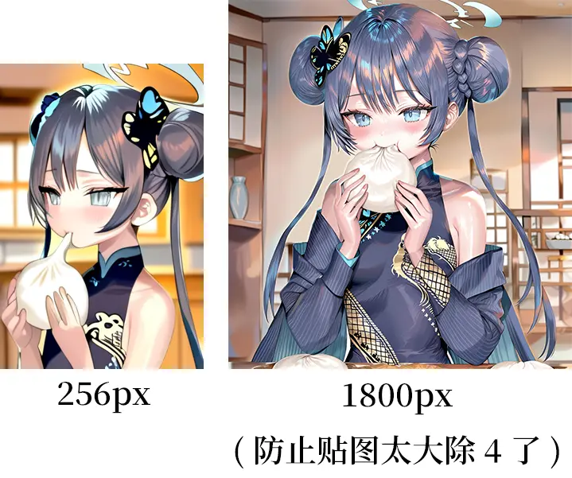

# RUM-F2K-4B 的使用文档！

项目地址: https://github.com/RimoChan/RUM

## 权重和使用方法

权重: https://huggingface.co/rimochan/RUM-FLUX.2-klein-4B-preview/tree/main

- diffusers用户
    - 可以参考根目录下的`推理.py`，模型路径和prompt都硬编码在文件里，改1下常量然后用python跑就可以了。此外，样例的prompt也在`推理.py`文件里可以复现。
- ComfyUI用户
    - 聪明群友帮我写了1个[ComfyUI-RUM](https://github.com/peter119lee/ComfyUI-RUM)，可以用它来跑。

权重文件的话，选最新的1296000，这个是既能T2I又能编辑的。不过我知道大家都想用Anima和Krea2生图，所以就把它当做是编辑模型也可以！

## T2I的Prompt格式

T2I的Prompt基本就是原版的Illustrious，是`person count, character names, rating, general tags, artist, year modifier`，比如:

- `1girl, kisaki (blue archive), general, holding baozi, eating, indoors, momoko (momopoco), newest`

除了person count和character names以外的部分训练时都有dropout，所以也可以不填。

## 1些编辑的Case

至于编辑的Prompt，大体上就是你想要什么就加什么，不想要什么就写`remove 它`。

现在编辑感觉也不是那么灵敏，不过好在我测试出了1些秘法，如果遇到编辑不响应的情况，可以试试:

- 在Prompt的前面加上/去掉`change to`。
- 把英文翻译成中文。
- 加上/去掉`1girl`
- 换seed多试几次。

这样多换几次它总会响应的！

此外，因为编辑本身计算量比较大，如果嫌测试prompt慢的话，可以先把图片resize小，测好prompt之后，再用原本的的size推理。

## 关于自然语言和中文

训练时是没有这些prompt的。不过因为没有训Text Encoder的部分，可能Qwen本身对得比较齐或者怎么样，现在居然是可以用中文写tag的，自然语言方面，可以理解1些简单的描述，稍微复杂1点就不行了。

比如这3个prompt:

- `1girl, kisaki (blue archive), 吃包子, 室内, momoko (momopoco)`
    - 能正常生成，但怪怪的。
- `a quick brown fox jumps over lazy dog, momoko (momopoco)`
    - 不能正常生成，结果是只奇怪的狐狸，没有在跳也没有狗。
- `免费的火腿, 免费的鸡蛋, 一大块上好的免费的炸牛排, 加上所有的配菜, 再浇上浓浓的汁, fuzichoco`
    - 能正常生成，但怪怪的。

## 关于分辨率

训练时的分辨率是576-1280(按调和平均算)，所以大家尽量在这个范围里用就好了。

不过，实际上测试下来发现256-1800的分辨率其实都能生成。

- 更小的尺寸会使画面变成碎片。
- 更大的尺寸会出现各种怪东西，但其实也没必要，这个模型太大了，生成中等尺寸再用小1点的模型超分会更好。

## 其他参数

CFG建议开5-15。可能是因为数据构造的问题，正负方向非常接近，所以范围很大，不会出现过饱和。不过因为我其实是色盲，等下颜色不对你问我我也只能说「看起来很正常啊」。

num_inference_steps建议开20。算法介绍的页面有解释它为什么不是1个步数蒸馏的模型。

剩下的就保持默认吧，应该也没什么可调的了。

## 结束

就这样，大家88，我要去召唤究极至高的隼了！
